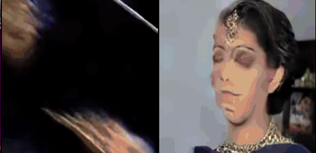

# Text to Video

Experimental text-to-video using Cosmos VAE + LapFlow multiscale joint attention. Pose embedding via axial pose embedding with temporal awareness.

### How to Train

```bash
python train.py
```

### Results at 600K iteration

Trained using Moving MSR-VTT Dataset:



## Citations

```bibtex
@misc{zhao2026laplacianmultiscaleflowmatching,
    title   = {Laplacian Multi-scale Flow Matching for Generative Modeling},
    author  = {Zelin Zhao and Petr Molodyk and Haotian Xue and Yongxin Chen},
    year    = {2026},
    eprint  = {2602.19461},
    archivePrefix = {arXiv},
    primaryClass = {cs.CV},
    url     = {https://arxiv.org/abs/2602.19461},
}
```
